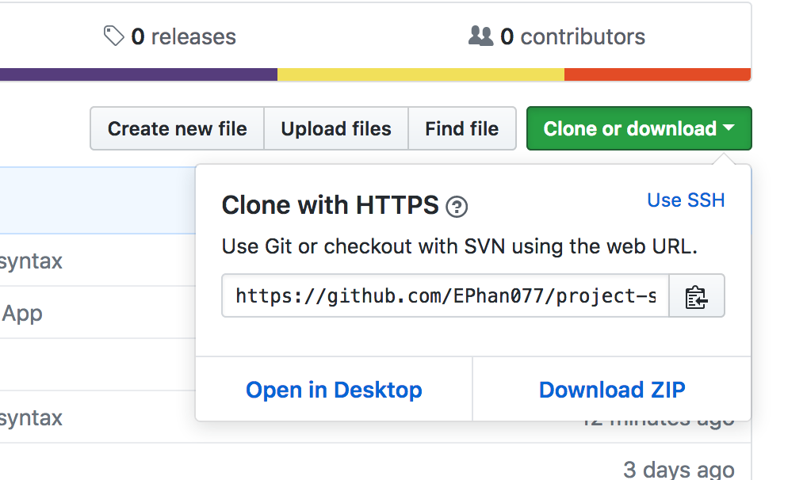

# Project API Search App

This project's purpose is to develop a basic site using scss, semantic html, javascript and API. I have built a basic search application using html, sass(scss), gulp, and javascript. It connects to an API that populate a page with the results. I chose to utilize the [Movie Database API](https://developers.themoviedb.org/3/getting-started/introduction).

## Styled with HTML and SCSS Requirements

* Variables for font family, font size, and an action color.
* One mixin for a useful, reusable segment of styles.
* Two uses of nesting, but never more than three levels deep.
* One placeholder (%) and at least three uses of extend.
* A folder structure consisting of at least 3 folders, 5 partial files, imported into a single main scss file.

## Automated with Gulp

A gulp file was created to handle compiling the scss files.

## Generated resultes with the API

* Captured search query from the search box and build the request url.
* Made an AJAX request to the API endpoint.
* Generated the results to match useful data from the API, conforming to the general layout provided.
* Added a No Result output.

## The MovieBox API Webpage

[MovieBox](https://ephan077.github.io/project-setup-API-search-app/). If you'd like to run this locally please clone or download.

